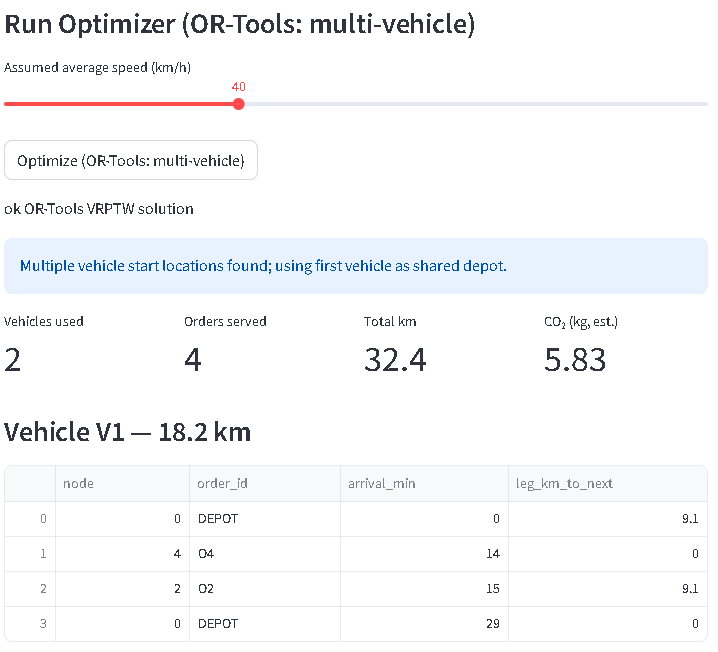
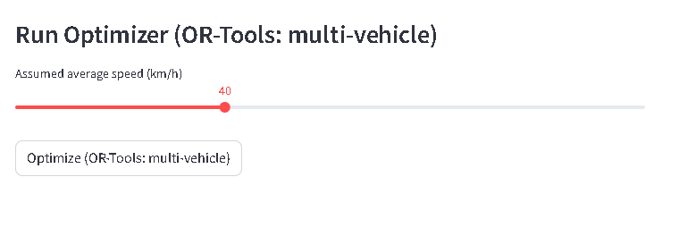

# Farm Market Optimizer (FMO)  
### *A Data-Driven Routing Prototype for Small Farms & Local Food Networks*

---

## Overview  

The **Farm Market Optimizer (FMO)** is a lightweight route-optimization demo designed to help small farms, cooperatives, and local distributors generate simple delivery routes using basic tabular data.

This prototype shows how **Python, OR-Tools, and Streamlit** can automate farm-to-market routing and provide clear, easy-to-understand outputs—ideal for small agricultural operations that rely on spreadsheets or manual planning.

The long-term vision is to integrate **machine learning–powered ETA predictions and delay-risk scoring**, turning this app into a decision-support tool for rural delivery networks.

---

## The Problem  

Smallholder farms and regional food systems typically face:

- Manual route planning using spreadsheets or whiteboards  
- Inefficient delivery sequences and wasted mileage  
- High fuel costs for under-optimized routes  
- No clear ETA estimates or delivery predictability  
- Lack of tools that are affordable and simple  
- Strong seasonal and geographic variability  

FMO demonstrates how modern optimization tools can help solve these challenges—without needing a large IT team or expensive SaaS platforms.

---

##  Objectives  

- Show how **Vehicle Routing Problem (VRP)** optimization can work with minimal data  
- Enable CSV upload for farms, markets, and vehicles  
- Generate optimized routes with estimated travel times  
- Provide a clean, simple Streamlit user interface  
- Build a foundation for future ML enhancements (ETA prediction, delay risk, route scoring)  
- Demonstrate practical data engineering + optimization for agriculture  

---

### Core Components  
- **Data ingestion:** User uploads CSV files or uses provided samples  
- **Distance matrix:** Simple Euclidean distance (MVP)  
- **Routing engine:** OR-Tools Vehicle Routing Problem solver  
- **ETA model:** Constant-speed placeholder for travel time  
- **UI:** Streamlit-based dashboard for route visualization  

---

## Features  

- Upload your own farm, market, and vehicle CSV files  
- Auto-generate distance matrix from coordinate data  
- Solve delivery routes using OR-Tools VRP  
- Assign stops to vehicles according to capacity limits  
- Produce a clear route manifest for each vehicle  
- Display routes and ETAs in a simple dashboard  
- Export route results for further analysis  

---

##  Known Issues & Limitations  

This is an early MVP with several intentional limitations:

### **Data Limitations**
- Synthetic CSVs only—no real farm/mill datasets yet  
- Euclidean distances (no road network, traffic, or elevation data)

### **Solver Constraints**
- No delivery time windows  
- No perishability or cold-chain penalties  
- Solver slows down above ~20 starting points  

### **ETA Model**
- ETA uses a fixed-speed assumption  
- No terrain, weather, or traffic adjustments  
- No machine learning ETA model yet  

### **UI Limitations**
- Limited map interactivity  
- No bilingual (EN/ES) option yet  
- Minimal input validation for upload files  

### **Backend / Scalability**
- No caching or async background tasks  
- No deployment pipeline yet  
- Local-only runtime; no cloud database integration  

### **Missing Integrations**
- No WhatsApp or SMS farm submission form  
- No Google Sheets ingestion  
- No cloud-hosted PostgreSQL backend  

---

##  Roadmap (2025 → 2026)

Planned future enhancements include:

### **Machine Learning Additions**
- ML-powered ETA model trained via the *Delivery Forecasting Notebook*  
- Delay-risk classifier for routes  
- Feature-based route scoring (road type, seasonality, elevation)  

### **Data Engineering & Integrations**
- Google Sheets → FMO ingestion pipeline  
- WhatsApp form for farmers submitting loads  
- Cloud-hosted database & caching layer  

### **Routing Enhancements**
- Time-window constraints  
- Cold-chain & perishability scoring  
- Multi-day routing & schedule generation  
- Incorporating real elevation and terrain data  

### **UX & Internationalization**
- Bilingual interface (English + Spanish)  
- Improved map interface with route overlays  
- Printable manifests & PDF exporter  

### **Agriculture-Specific Extensions**
- Coffee farm → mill → exporter routing  
- Regional harvesting “heat maps”  
- Seasonal logistics recommendations  

---

## Repository Structure  

---

## Demo Preview  

---

##  Integration with ML Studies  

This project is designed to ingest ML outputs from  **Delivery Forecasting Notebook**, including:

- Data-driven ETAs instead of constant speed  
- Delay-risk classification for each route  
- Feature-based scoring (road type, seasonality, elevation, weather)  

Future versions of FMO will use machine learning to provide smarter scheduling and routing recommendations

---

## What I Learned  

- How small routing inputs can drastically change optimization outputs  
- Practical differences between theoretical VRP and real farm logistics  
- Importance of clean data preprocessing in geospatial systems  
- Why ETAs matter for real users and how ML can improve them  
- How to build an app that can evolve from rule-based → ML-enhanced  

---

## Contact  

If you have questions or want to collaborate:
